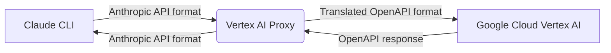

# Architecture

This document describes the architecture of the Vertex AI Proxy, a service that translates Anthropic API requests to Google Cloud Vertex AI's Qwen3 model.

## Overview

The Vertex AI Proxy is a Rust application built with Axum (web framework), Tokio (async runtime), and Reqwest (HTTP client). It acts as a translation layer between the Anthropic API format and Google Cloud Vertex AI's OpenAPI format.



## Components

### 1. API Server (Axum)

The core of the proxy is an Axum web server that exposes two endpoints:

- `POST /v1/messages`: Handles Anthropic API requests
- `GET /health`: Health check endpoint

The server is built with Axum's router, extractors, and middleware system.

### 2. Request Translation Layer

This is the heart of the proxy, responsible for converting between Anthropic and Vertex AI formats.

#### Key Translation Functions:

- `translate_messages()`: Converts Anthropic message format to OpenAI-compatible format
- `translate_tools()`: Translates Anthropic tool definitions to OpenAI function format
- `translate_tool_choice()`: Maps Anthropic tool choice to OpenAI equivalent
- `map_stop_reason()`: Converts Vertex AI stop reasons to Anthropic equivalents

The translation handles:
- Message roles (user, assistant, system)
- Content blocks (text, tool_use, tool_result)
- Tool definitions and calls
- Streaming vs non-streaming responses
- Parameter mapping (temperature, top_p, etc.)

### 3. Authentication Layer

The proxy uses Google Cloud's Application Default Credentials (ADC) for authentication:

- `TokenManager`: Manages OAuth2 token lifecycle
- `from_adc()`: Loads credentials from ADC file
- `get_token()`: Retrieves current access token (with caching)
- `refresh()`: Refreshes expired tokens

The token manager caches tokens and automatically refreshes them before expiration.

### 4. State Management

The proxy maintains application state in an `Arc<AppState>` structure that is shared across all request handlers:

```rust
struct AppState {
    endpoint: String,
    project_id: String,
    region: String,
    model: String,
    token_manager: TokenManager,
    logs: Mutex<Vec<RequestLog>>,
    total_requests: Mutex<u64>,
    total_input_tokens: Mutex<u64>,
    total_output_tokens: Mutex<u64>,
    rps_history: Mutex<Vec<u64>>,
    host: String,
    port: u16,
    external_ip: Option<String>,
    max_output_tokens: u32,
}
```

### 5. Streaming Handler

For streaming requests, the proxy implements a custom stream transformer:

- `make_anthropic_stream()`: Creates a stream that transforms Vertex AI SSE events to Anthropic SSE events
- Handles all event types: message_start, content_block_start, content_block_delta, message_delta, message_stop
- Manages tool call streaming with proper state tracking
- Estimates token usage in real-time

### 6. Terminal UI (TUI)

The proxy includes a built-in terminal user interface using Ratatui:

- Real-time request logging
- Performance metrics (RPS, token usage)
- Connection status and usage instructions
- Quit with 'q' or Esc

## Data Flow

### Non-Streaming Request Flow

1. Client sends POST request to `/v1/messages` with Anthropic format
2. Request is parsed into `AnthropicRequest` struct
3. Request is translated to `OpenAIRequest` format
4. Access token is retrieved from `TokenManager`
5. Translated request is sent to Vertex AI endpoint
6. Response is received and parsed
7. Response is translated back to Anthropic format
8. JSON response is returned to client

### Streaming Request Flow

1. Client sends POST request with `stream: true`
2. Request is parsed and translated (same as non-streaming)
3. Access token is retrieved
4. Streaming request is sent to Vertex AI
5. `make_anthropic_stream()` creates a stream transformer
6. Vertex AI SSE events are parsed and transformed in real-time
7. Transformed events are sent to client as they arrive
8. Stream ends with message_delta and message_stop events

## Configuration

The proxy supports configuration through environment variables and command-line arguments:

### Environment Variables

- `VERTEX_ENDPOINT`: Vertex AI endpoint (default: `aiplatform.googleapis.com`)
- `VERTEX_REGION`: Region for Vertex AI (default: `global`)
- `VERTEX_MODEL`: Model to use (default: `qwen/qwen3-235b-a22b-instruct-2507-maas`)
- `VERTEX_PROJECT_ID`: GCP project ID
- `VERTEX_MAX_OUTPUT_TOKENS`: Maximum output tokens (default: 16384)
- `PORT`: Port to listen on (default: `8082`)
- `HOST`: Host to bind to (default: `127.0.0.1`)

### Command-Line Arguments

- `--host <addr>`: Bind address (overrides HOST env var)
- `serve`: Run as server (no TUI)
- `launch <cmd> ...`: Run proxy and launch command with environment

## Error Handling

The proxy implements comprehensive error handling:

- Token refresh failures are retried on each request
- Upstream errors are propagated with appropriate HTTP status codes
- Malformed requests return 400 Bad Request
- Authentication failures return 401 Unauthorized
- Internal errors return 500 Internal Server Error

## Performance Considerations

- Token caching reduces OAuth2 overhead
- Stream processing minimizes memory usage for streaming requests
- Request logging is limited to 500 entries to prevent memory growth
- RPS history is limited to 60 seconds of data
- Token estimation uses a simple character-based heuristic

## Security Considerations

- Uses Google Cloud ADC for secure authentication
- No sensitive data is logged (request content is truncated in logs)
- Supports binding to localhost only (default) or all interfaces
- All communication with Vertex AI is over HTTPS
- No API key validation (uses "vertex-ai-proxy" as placeholder)

## Future Enhancements

- Support for additional Vertex AI models
- Configurable model mapping
- Enhanced logging and monitoring
- Rate limiting and quota management
- Support for additional Anthropic API features
- Web-based monitoring dashboard